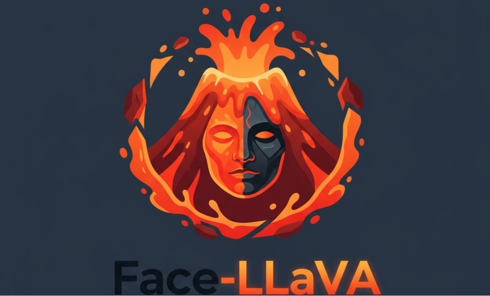
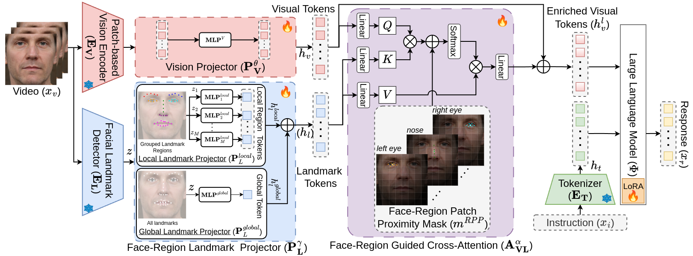
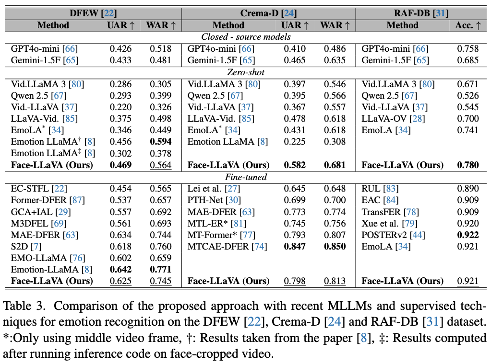
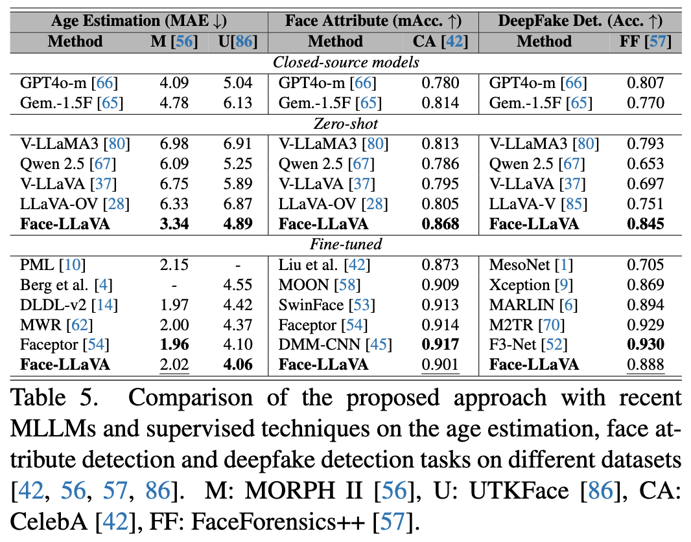

<div align="center">
  

  <h1>Facial Expression and Attribute Understanding through Instruction Tuning</h1>
  <h3>WACV 2026</h3>

  <p>
    <a href="https://arxiv.org/abs/2504.07198">
      
    </a>
    <a href="https://github.com/ihp-lab/Face-LLaVA">
      
    </a>
    <a href="https://face-llava.github.io/">
      
    </a>
    <a href="https://huggingface.co/chaubeyG/FaceLLaVA">
      
    </a>
    <a href="LICENSE.rst">
      
    </a>
    <a href="https://www.python.org/">
      
    </a>
    
  </p>
  <br>
</div>

This is the official codebase of the **WACV 2026 Round 1** Early Accept paper (6.4% acceptance rate) - Face-LLaVA: Facial Expression and Attribute Understanding through Instruction Tuning. 

---

## 🧾 Abstract

The human face plays a central role in social communication, necessitating the use of performant computer vision tools for human-centered applications. We propose Face-LLaVA, a multimodal large language model for face-centered, in-context learning, including facial expression and attribute recognition. Additionally, Face-LLaVA is able to generate natural language descriptions that can be used for reasoning. Leveraging existing visual databases, we first developed FaceInstruct-1M, a face-centered database for instruction tuning MLLMs for face processing. We then developed a novel face-specific visual encoder powered by Face-Region Guided Cross-Attention that integrates face geometry with local visual features. We evaluated the proposed method across nine different datasets and five different face processing tasks, including facial expression recognition, action unit detection, facial attribute detection, age estimation and deepfake detection. Face-LLaVA achieves superior results compared to existing open-source MLLMs and competitive performance compared to commercial solutions. Our model output also receives a higher reasoning rating by GPT under a zero-shot setting across all the tasks. 

<div align="center">
  
</div>

---

## 📣 News

- [Oct. 2025] Initial release of the official codebase and model weights. Stay tuned for more details and the dataset.
- [Sept. 2025] Face-LLaVA accepted in the first round of WACV 2026 (6.4% acceptance rate). See you in Tucson!

## 🏆 Results


<details>
<summary>Facial Expression Recognition</summary>

<div align="center">
  
</div>

</details>

---

<details>
<summary>Facial Attribute and Age Estimation</summary>

<div align="center">
  
</div>

</details>

## 📦 Repository Structure

```bash
├── cache_dir/             # Automatically created to store downloaded LanguageBind models
├── checkpoints/           # Folder to store model weights
├── facellava/             # Main source code
├── scripts/               # Training scripts for Face-LLaVA
```

---

## 🔧 Installation

1. **Clone the repository**
    ```bash
    git clone https://github.com/ac-alpha/face-llava.git
    cd Face-LLaVA
    ```

2. **Create a virtual environment** (recommended)
    ```bash
    conda create -n facellava python=3.10 -y
    conda activate facellava
    ```

3. **Install torch**
    ```bash
    pip install torch==2.5.1 torchvision torchaudio --index-url https://download.pytorch.org/whl/cu121
    ```

    <details>
    <summary>Potential issues</summary>

    - You might want to download PyTorch for a different version of CUDA. We download it for CUDA-12.1 but we have tested it on a machine with CUDA-12.2 as well. However, you might need to change this depending on your machine.
    - Based on the above, you might also have to upgrade/downgrade torch. 
    
    </details>
    

4. **Install in editable mode for development**:
    ```bash
    pip install -e .
    pip install -e ".[train]" ## if you want to train your own model
    ```

5. **Install other libraries**:
    ```bash
    pip install flash-attn --no-build-isolation ## recommended but not required
    pip install decord opencv-python git+https://github.com/facebookresearch/pytorchvideo.git@28fe037d212663c6a24f373b94cc5d478c8c1a1d
    ```


---

## 🎯 Inference

1. Download the model weights from [huggingface](https://huggingface.co/chaubeyG/FaceLLaVA) inside `checkpoints/` folder so that the structure becomes - `./checkpoints/FaceLLaVA`.

2. Crop the input image/video using `tools/crop_face.py` before further processing. 

    Use the following command to crop an image

    ```python
    python crop_face.py \
        --mode image \
        --image_path "/path/to/input.jpg" \
        --output_image_path "/path/to/output_cropped.jpg"
    ```

    Use the following command to crop a video
    ```python
    python crop_face.py \
        --mode video \
        --video_path "/path/to/input/video.mp4" \
        --output_video_path "/path/to/output/cropped_video.mp4" \
        --temp_dir "/path/to/temp"
    ```

3. Run the following command for inference.

    ```bash
    CUDA_VISIBLE_DEVICES=0 python inference.py --model_path="./checkpoints/FaceLLaVA" \
    --file_path="./assets/demo_inputs/face_attr_example_1.png" --prompt="What are the facial attributes in the given image?"
    ```

4. **Currently the following face perception tasks are supported along with the best modality suited for that task - Emotion(Video), Age(Image), Facial Attributes(Image), Facial Action Units(Image)**

5. A list of prompts that work well for different tasks is present in `./assets/good_prompts`.

### ✅ Repository Progress

- [ ] Dataset Release
- [x] Training Script
- [x] Inference Code
- [x] Model Weights 

## ⚖️ License

This codebase is distributed under the USC Research license. See [LICENSE.rst](LICENSE.rst) for more details. This repo uses parts of code from the [VideoLLaVA](https://github.com/PKU-YuanGroup/Video-LLaVA) repo and our codebase inherit their license for those.

## 🙌 Credits

This codebase builds upon the following excellent works: [VideoLLaVA](https://github.com/PKU-YuanGroup/Video-LLaVA), [LLaVA](https://github.com/haotian-liu/LLaVA) and [LLaVA-Next](https://github.com/LLaVA-VL/LLaVA-NeXT). We gratefully acknowledge their contributions to the open-source community.

## 🪶 Citation

```latex
@article{chaubey2025face,
  title={Face-LLaVA: Facial Expression and Attribute Understanding through Instruction Tuning},
  author={Chaubey, Ashutosh and Guan, Xulang and Soleymani, Mohammad},
  journal={arXiv preprint arXiv:2504.07198},
  year={2025}
}
```
